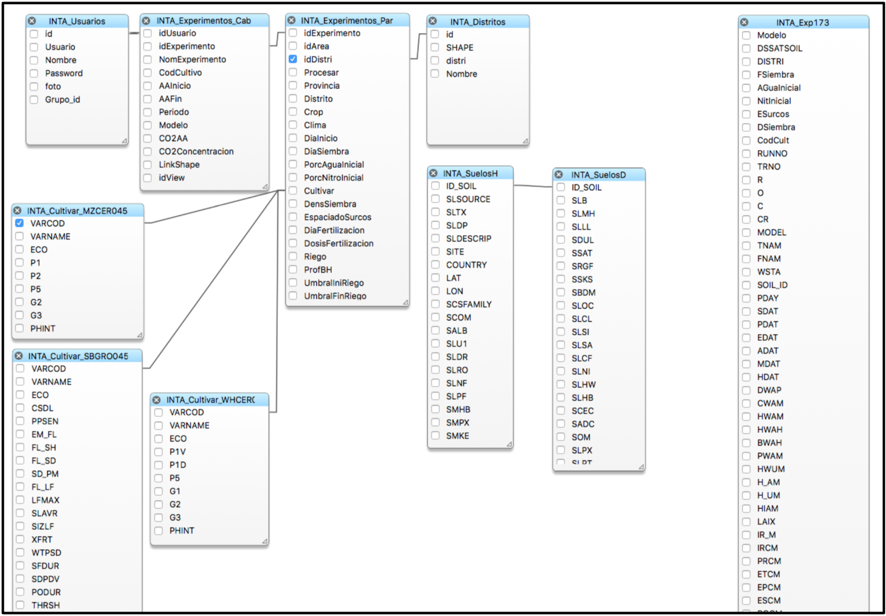

# CASANDRA-CC. Guía Técnica.

## Concepto: Plataforma web para el estudio de impacto y evaluación de medidas de adaptación al cambio climático.

## Documentación:

* Para ver un esquema conceptual/funcional de la plataforma: https://www.dropbox.com/s/tub0mcaam89wfu1/Casandra.agMIP2.pdf?dl=0
* Fuentes del modelo DSSAT4.6: https://www.dropbox.com/s/3g12tmki1s0pcqh/CSMv4.6.zip?dl=0
* Para ver cómo usarlo existe un webinar en el link siguiente ( ir al minuto 36 ): https://vimeo.com/170188682.
* Los componentes del sistema son todos “open source”. Instalación de VPS para Casandra (componentes):
* MySQL
* php (con los modulos de mysql , dbase ) Tener en cuenta que requiere PHP
5.6 y no el 7 que viene en estable en esta versión de ubuntu
* apache ( con php y mysql activo)
* gdal (chequear que el ogr2ogr tiene el output format MySQL)
* cdo (climate data operator)con netcdf y grib2 ( este último si es posible)
* nco (netcdf climate operators , ncks!)
* wgrib y muy importante WGRIB2!
* grads (version 2.0 o superior)
* compilador fortran (gfortran)
* librerias (netcdf)
* Imagemagick
* dbase 
* R
* librerias R
* Repo: r-recommended r-base-html o install.packages("classInt")
* install.packages("e1071”)
* install.packages("gpclib”)
* install.packages("maptools”) o install.packages("ncdf4”)
* install.packages("sp”)

   
# Datos técnicos del MODELO DSSAT:
* Sistema operativo: Linux (Debian).
* Modelo de crecimiento de cultivo: DSSAT 4.6 , es un conjunto de más de 20 modelos de crecimiento de cultivos. Entre los que se encuentra maíz, soja, trigo y girasol. La fuente esta en archivo adjunto, y puede ser compilado con gfortran. Link a los modelos:
https://dssat.net
* Compilador FORTRAN: Se puede usar gfortran ( disponible en Linux) , open source.
* Directorio de la aplicación /datos/CasandraCC.
* Nombre de la BD: CASANDRACC
* Acceso, Usuario y Contraseña: está en /datos/CasandraCC/php/db.php
* Diseño de BD:

  

1. First ordered list item
   1. Another item
   2. another 2
